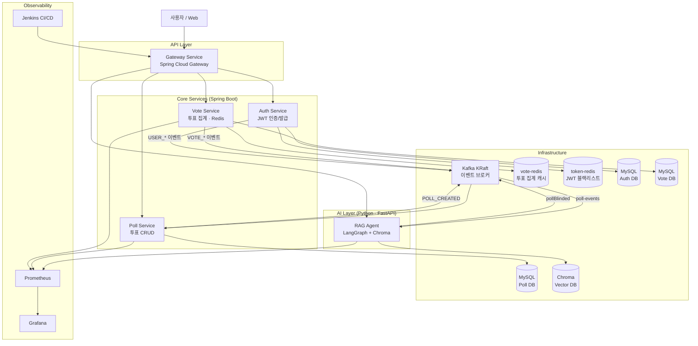
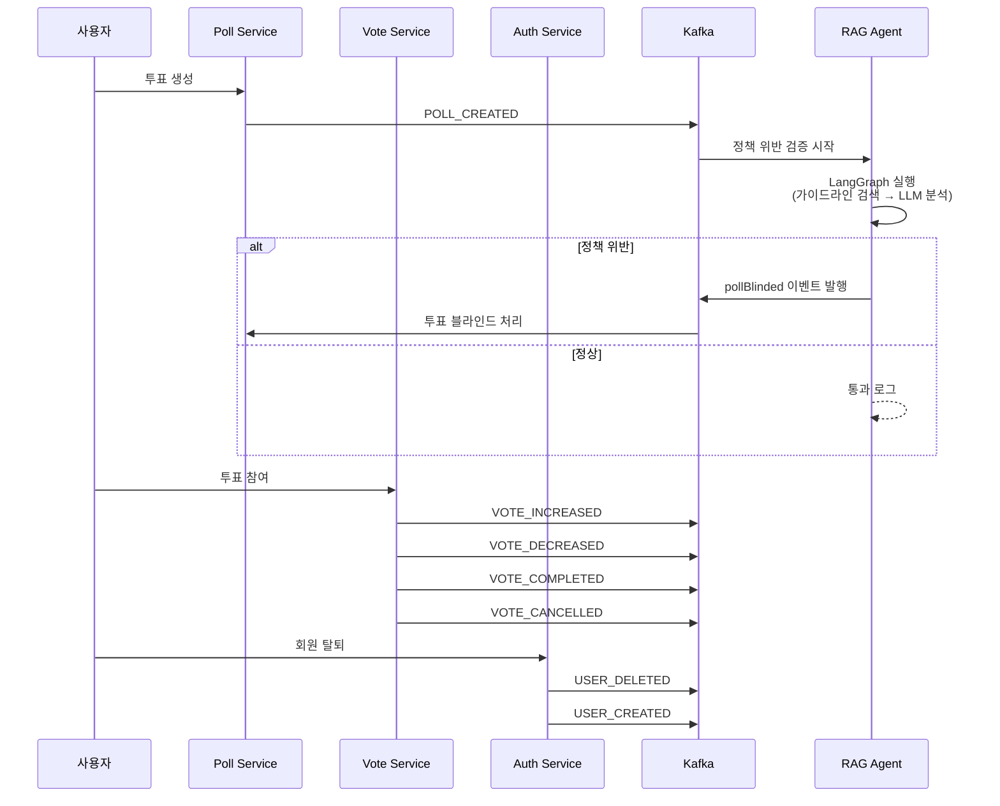
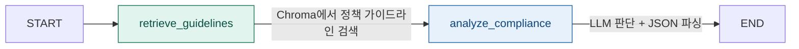

# EveryPoll MSA

> JWT 기반 투표 플랫폼. Spring Boot 마이크로서비스 + LangGraph AI 에이전트로 구성된 실시간 투표 서비스

---

## 아키텍처 개요



---

## 서비스 구성

| 서비스 | 언어 | 역할 |
|---|---|---|
| `gatewayService` | Java (Spring Cloud Gateway) | 라우팅, 인증 필터 |
| `authService` | Java (Spring Boot) | 회원가입/로그인, JWT 발급·검증 |
| `pollService` | Java (Spring Boot) | 투표 CRUD, Kafka 이벤트 발행 |
| `voteService` | Java (Spring Boot) | 투표 집계, Redis 캐싱 |
| `rag-agent` | Python (FastAPI) | AI 정책 검증, 댓글 요약, 벡터 DB |

---

## Kafka 이벤트 흐름

서비스 간 직접 통신 없이 Kafka 이벤트로 느슨하게 연결됩니다.



### 이벤트 목록

| 이벤트 | 발행 서비스 | 설명 |
|---|---|---|
| `POLL_CREATED` | Poll Service | 투표 생성 → RAG Agent 정책 검증 트리거 |
| `COMMENT_CREATED` | Poll Service | 댓글 생성 → RAG Agent 배치 수집 후 요약·벡터 인덱싱 |
| `pollBlinded` | RAG Agent | 정책 위반 투표 블라인드 처리 |
| `VOTE_CREATED` | Vote Service | 투표 완료 |
| `VOTE_CANCELLED` | Vote Service | 투표 취소 |
| `USER_CREATED` | Auth Service | 유저 생성 |
| `USER_DELETED` | Auth Service | 유저 삭제 |

---

## AI 에이전트 (RAG Agent)

Python FastAPI + LangGraph로 구현된 AI 서비스입니다.

### 기능 1 — 투표 정책 위반 자동 검증 (LangGraph)

투표가 생성되면 Kafka 이벤트를 수신해 LangGraph 워크플로우로 정책 위반 여부를 자동 판단합니다.
혐오 표현, 정치적 편향, 분란 조장 등이 감지되면 `pollBlinded` 이벤트를 Kafka로 발행해 자동 블라인드 처리합니다.



- `retrieve_guidelines` — Chroma 벡터 DB에서 정책 가이드라인 문서 검색
- `analyze_compliance` — LLM으로 위반 여부 판단, JSON 파싱 실패 시 Fail-safe(차단) 처리
- LLM 응답의 `<think>` 태그(추론 과정)를 정규식으로 제거 후 JSON 파싱

### 기능 2 — 댓글 실시간 요약 및 벡터 인덱싱

`COMMENT_CREATED` 이벤트를 배치로 모아 LLM으로 댓글 분위기를 요약하고 Chroma에 저장합니다.
이후 `/api/v1/polls/{poll_id}/summary` API로 조회 가능합니다.

### 기능 3 — Fast Sync 욕설 필터

LLM 호출 없이 동기적으로 즉시 판단하는 경량 필터입니다.

```
POST /api/v1/verify/fast
{"text": "검사할 텍스트"}
→ {"is_allowed": true/false, "reason": null/"slang"}
```

---

## 기술 스택

| 분류 | 기술 |
|---|---|
| Backend | Java 17, Spring Boot 3, Spring Cloud Gateway |
| AI | Python, FastAPI, LangGraph, LangChain, ChromaDB |
| LLM | Qwen3 (4bit GPTQ, 자체 서빙), BAAI/bge-m3 (임베딩) |
| Message Broker | Apache Kafka (KRaft 모드) |
| Database | MySQL 8.0 (서비스별 독립 DB), Redis |
| CI/CD | Jenkins, Docker, Docker Compose |
| Observability | Prometheus, Grafana |

---

## 기술 결정 이유

**왜 MSA로 구성했나?**
서비스별 독립 배포와 장애 격리를 위해 선택했습니다. 투표 집계(voteService)에 트래픽이 몰려도 인증 서비스(authService)는 영향받지 않습니다.

**왜 Kafka를 썼나?**
투표 생성 → AI 검증 → 블라인드 처리 흐름에서 서비스 간 직접 HTTP 호출 대신 이벤트 기반으로 분리했습니다. RAG Agent가 다운되더라도 Poll Service는 정상 동작하고, 이벤트는 Kafka에 보존됩니다.

**왜 LangGraph를 썼나?**
단순 LLM 호출로는 JSON 파싱 실패, 잘못된 형식 응답 등을 제어하기 어렵습니다. LangGraph의 노드 기반 워크플로우로 가이드라인 검색 → LLM 분석 → 파싱 실패 시 Fail-safe 처리를 명시적으로 구성했습니다.

**왜 서비스별 독립 MySQL DB?**
MSA의 핵심 원칙인 DB 독립성을 지켰습니다. 서비스 간 DB를 공유하면 스키마 변경 시 다른 서비스에 영향을 줍니다.

**왜 Redis를 두 개로 분리했나?**
`vote-redis`는 투표 집계 캐시, `token-redis`는 JWT 블랙리스트(로그아웃 처리)용으로 역할이 다릅니다.
하나의 Redis에 혼재하면 키 충돌과 TTL 관리가 복잡해지고, 한쪽 장애가 다른 기능에 영향을 줍니다.

**왜 Kafka를 KRaft 모드로 구성했나?**
기존 Kafka는 메타데이터 관리를 위해 Zookeeper가 필수였지만, KRaft 모드는 Zookeeper 없이 단독으로 동작합니다.
라즈베리파이처럼 리소스가 제한된 환경에서 컨테이너 하나를 줄일 수 있고, 구성도 단순해집니다.

---

## 로컬 실행

```bash
git clone https://github.com/pkun2/everypoll-msa.git
cd everypoll-msa

# 환경 변수 설정 (각 서비스 폴더의 .env.example 참고)
cp rag-agent/.env.ai.example rag-agent/.env

# 전체 서비스 실행
docker compose up -d
```

### 서비스 포트

| 서비스 | 포트 | 비고 |
|---|---|---|
| Frontend | 3000 | |
| Gateway | 8080 | 외부 노출 유일한 진입점 |
| Auth Service | 8081 | 내부망만 노출 (`expose`) |
| Poll Service | 8082 | 내부망만 노출 (`expose`) |
| Vote Service | 8083 | 내부망만 노출 (`expose`) |
| RAG Agent | 8084 | 별도 실행 |
| Jenkins | 9090 | CI/CD |
| Kafka (내부) | 9092 | 컨테이너 간 통신 |
| Kafka (외부) | 29092 | AI 서버(외부 PC) 접근용 |

---

## Observability

Prometheus + Grafana로 모든 서비스 메트릭을 수집합니다.

RAG Agent에서 수집하는 주요 메트릭:

| 메트릭 | 설명 |
|---|---|
| `langgraph_node_duration_seconds` | 노드별 실행 시간 |
| `policy_check_total` | 정책 검증 결과 (pass/violation/error) |
| `summarization_duration_seconds` | 댓글 요약 소요 시간 |
| `kafka_events_total` | 처리된 Kafka 이벤트 수 |
| `vectordb_query_duration_seconds` | 벡터 DB 쿼리 시간 |

---

## 트러블슈팅 경험

**LLM 응답 파싱 실패 문제**

Qwen3 모델은 응답 전에 `<think>...</think>` 태그로 추론 과정을 출력합니다.
이를 그대로 JSON 파싱하면 항상 실패하는 문제가 있었습니다.

```python
# 해결: 정규식으로 <think> 태그 제거 후 JSON 추출
clean_content = re.sub(
    r'<think>.*?(</think>|$)',
    '',
    response.content,
    flags=re.DOTALL | re.IGNORECASE
).strip()
match = re.search(r'\{.*\}', clean_content, re.DOTALL)
```

토큰 초과로 `</think>`가 잘린 경우(`$`로 처리)와 JSON 블록만 추출하는 로직을 추가해 해결했습니다.
파싱이 끝까지 실패하면 `is_violation: True`로 Fail-safe 처리해 안전성을 확보했습니다.

---

**Spring ↔ Python 간 Kafka 메시지 직렬화 불일치 문제**

Spring 쪽 이벤트 클래스에 `@JsonTypeInfo(use = Id.CLASS)`를 적용하면 Kafka 메시지에 `@class` 필드로 Java 풀 클래스명이 포함됩니다.

```json
{
  "@class": "com.everypoll.common.event.poll.CommentCreatedEvent",
  "type": "COMMENT_CREATED",
  "pollId": 42,
  "content": "짜장면이 맞지"
}
```

Python(RAG Agent)에서는 `@class` 필드를 인식하지 못하고 `type` 필드로만 이벤트를 라우팅해야 했습니다.
또한 Spring 쪽 이벤트마다 `type` 필드명이 `event`, `eventType`, `type`으로 혼재해 있어 파싱 실패가 발생했습니다.

```python
# 해결: 여러 필드명을 순서대로 fallback하여 이벤트 타입 추출
event_type = data.get("event") or data.get("eventType") or data.get("type")
```

이후 Spring 이벤트 클래스의 `type` 필드명을 통일하고, Python 쪽에서도 fallback 체인을 유지해 하위 호환성을 확보했습니다.